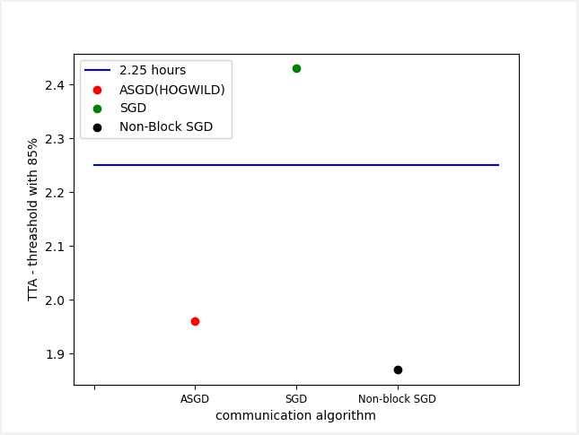

# Non-blocking Synchronous SGD: a novel communication scheme for distributed deep learning

This repository is for NYU - High Performance Computing for Machine Learning Final-Project. 

- `Author`: Haoze He `NYUID`: hh2537

## Abstract

In recent years, the size of deep learning models, number of computations, and data set increase dramatically. Distributed deep learning system aims to reduce the overall training time utilize multiple computing devices to solve this problem. However, the data communication between computing devices becomes the bottleneck. When and how to do communication between different workers also becomes a problem. There are two dominant communication schemes to solve this problem: synchronous distributed stochastic gradient descent(SSGD) and asynchronization stochastic gradient descent(ASSGD). The synchronization in the data-parallel distributed deep learning works in the following way: before the next iteration of training, every worker should wait for all workers to finish the transmission of parameters in the current iteration. In the asynchronous framework, the parameter server(PS) can update the global model with the updates from several or even one worker instead of all workers. In contrast to synchronous algorithms, the asynchronous framework allows more independent updates of the nodes, which cut down the data transmitted during the communication between the current workers and the master.

## Problem analysis

However, these two schemes have their own advantage and drawbacks. As for SSGD, since the server and every worker should wait for all workers to finish the transmission of parameters in the current iteration, it will waste a lot of time and lead to slow converge.[fig1] As for asynchronous, since the worker may update PS parameters based on previous model, it will lead to lower accuracy.[fig2] To solve these problem, more adapted schemes were proposed: downpour, backup workers, etc. However, these methods alleviate the problems instead of solving it. The trade-off between training efficiency and accuracy remains. These phenomenons are common especially when workers have different GPU, which will lead to huge gap for training efficiency.

## Goal and Objective

To solve the trade-off problem mentioned in previous section, I propose a new communication
scheme which is called `Non-blocking Synchronous SGD(NBSSGD)` which combines both SSGD
and ASGD together. By doing this, I can guarantee the accuracy as well as keep all workers
training without waiting, which will guarantee the efficiency as well.[fig3] 

## Non-blocking Synchronous SGD(NBSSGD)

As for the `NBSSGD` scheme,  I will take single PS parameter update as example: Assume there are two workers to do distributed deep learning. Batch assign to each worker will be divided into eight mini-batches.(from 258 batch size to 32 mini-batch-size) Workers will be trained using mini-batch instead of a large batch. By doing this, we can make sure each batch will take shorter time. Then, rather than having PS waiting for both compute nodes update the parameters, once any compute node complete its computation, in addition to transmit its own result back to PS, it will also broadcast a signal to all other compute node. Once other compute node receives the signal, it will send whatever current weight it has back to parameter server, get parameter update, and continue training on the rest of the batch. This approach combines the idea of both SSGD and ASGD together to prevent the compute node which finish first to stall for the update of weights from other compute nodes. If we want to prioritize training thought put by sacrificing the accuracy a little bit, we can even ignore the concurrency by letting the rushing condition happens naturally without locking and unlocking the shared weights.

##Approach/Techniques

`1`:**Hardware Approach**I can start from simple ones using existing resources: the NYU Greene HPC clusters mi50. To get computing resources shourtly, I use multiple cpu-nodes as workers and the parameter server instead of multiple-gpus(will be hard to get resources).  

`2`:**Code Approach**: Using torch.distributed and mpi as backend to build the communication scheme. Run the code on NYU HPC with multiple nodes. Single cpu/task per node. 

`4`:**Model used**: I utilize `RESNET50` and `CIFAR10` and models and dataset to test the communication shceme.

`3`:**Performance Test**: We use PyTorch programs to observe the effect and test our method and measure the TTA as well as the final accuracy comparing to other method such as `ASGD`, `HOGWILD(SGD)`, `Downpour`. Timing(TTA) and accuracy are tested.

## Main Result (TO BE FINISHED. WILL FINISH BEFORE PRE)

As we abserved(Experiment are executed based on `RESNET50` and `CIFAR10`, 4 workers and 1 paramerter server):

`Important: results are got from the average among 5 experiments with the same configurations `

- Non-blocking SGD has simiar accuracy with SGD and much higher than ASGD [fig4]
- Non-blocking SGD has similar TTA with ASGD and much quicker than SGD [fig5]
- Non-blocking SGD has even better TTA than ASGD when threashold is high enough(85%) [fig5]

## How to Run the Code(TO BE FINISHED, MORE CODE WILL BE UPLOADED)

Use sbatch to upload job to HPC. run `sbatch run.s` to submit the job. change the commend `mpirun -n 5 python ./test.py ` to the number of workers you want. Default worker is 5. Some Codes are reused from official resources

`Code Structure:`

-  `main.py` run the code

- `run.s`: the sbatch file

- `config.py`: configration file using argparse to define args

- `data_loader`:load data to the model. Data are partitioned for multiple nodes.

- `parameter_server.py`: implement parameter server using mpi and pytorch

- `serialization`: pull parameters and push parameters from the server

- `optimizer`: Optimizer designed for mutiple nodes training. More Optimizer will be added.

- `resnet`: The basic model of resnet. `resnet50` will be used as trainning method.

- `messaging`: Utilize MPI to  implement functions: send message/ Listen message/ broadcast message/ receive message.

- `more`: more utils will be added: function file to get accuracy, TTA, and draw pictures, etc.

`Most IMPORTANT!!`

- `mpi virtual env` is very hard to set up!!! To avid system/ enviroment error, here are two files to test MPI+torch basic functions.
- `test.py`and `test.s`. use `sbatch test.s` to run `test.py`. This will check whether MPI function available or not.

## Further works to do

`1`: Due to the limitation of computing resource, I only test our communication algorithm based on HPC-cm,cl instead of GPU. More experiments on different hardwares (GPU V-100/ GPU-RTX8000) is required.

`2`:Due to NYU HPC sbatch limitation, I could only apply for same hardware partition(cm or cl) on NYU HPC. According to the   `Non-blocking Synchronous SGD(NBSSGD)` algorithm, the imporvment will be better based on nodes have different hardwares. (Such as V100+RTX8000). Since V100 and RTX8000 many have differnt computing speed, the result will be even better.

`3`:Due to the limitation of resources and time, I could only finish result testing comparing to classic algorithm:   `HOGWILD`, `ASGD`, and `Downpour SGD`. More comparisons could be done with the state-of-the-art algorithm.

